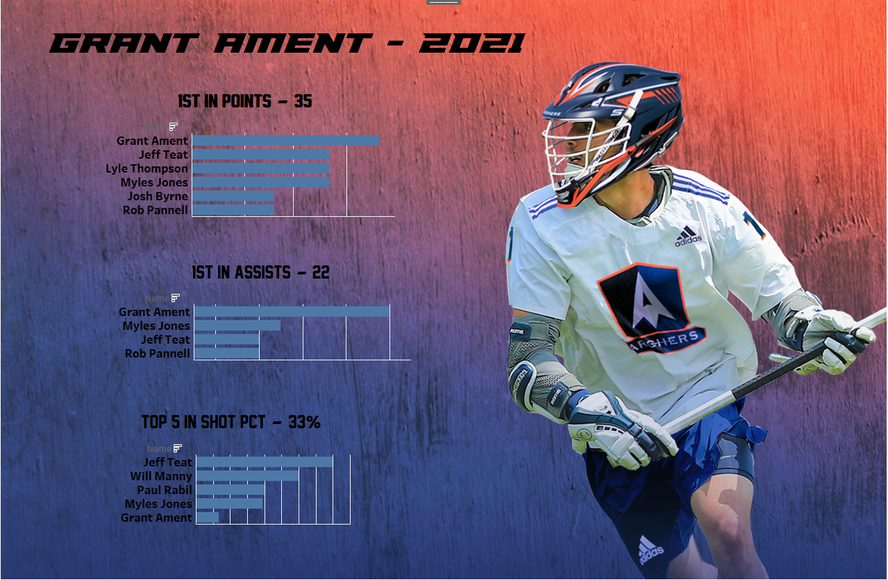

# pll_visualizations
This repository is a gallery of my Tableau visualizations for Premier Lacrosse League data. The data currently is from September 4, 2021, prior to the finish of the 2021 season. Once the Championship has been played, and data from the whole season is uploaded to the PLL website, a complete analysis and visualization of the season can begin.

I am always interested in receiving feedback on my work, so don't hesitate to shoot me a message.

## Grant Ament - 2021 Overview

[Grant Ament 2021 Overview - Tableau Public Dashboard](https://public.tableau.com/views/grant_ament_dashboard/Dashboard1?:language=en-US&publish=yes&:display_count=n&:origin=viz_share_link)

## PLL Goalie Analyis (Through the first 9 games)

[An Analysis of PLL Goalies Through the First 9 Games](https://public.tableau.com/app/profile/peter.nielsen6109/viz/best_goalie_analysis/Dashboard1)

 
